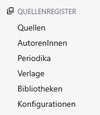

# contao-sources-bundle

### Quellen verwalten unter Contao (ab 5+)
Dieses Bundle bietet eine einfache Verwaltung von Quellen für das CMS Contao. Der Begriff **&raquo;Quellen&laquo;** wird hier in einem relativ **weiten Sinne** verwendet und bezieht sich vor allem **literarische Quellen, Drucke, Karten, Pläne und Risse, aber auch Fotos, Websites** und andere Entitäten, auf die in Contao zitiert werden.

Dabei orientiert sich die aktuelle Version ganz grob an APA 7, was in weiten Bereichen der wissenschaftlichen Publikationen als eine Art quasi-Standard betrachtet wird. Jedoch sind nicht alle Regeln von APA 7 hier bereits implementiert. 

**Zurzeit befindet sich das Bundle noch in einem experimentellen Stadium!**

## Folgende Funktionen sind implementiert
### 0. Konzept (Schnelleinstieg - leider alles noch experimentell)
Das grundlegende Konzept des Bundles besteht darin, dass der Redakteur / die Redakteurin Quellen erfassen und zitieren kann, so wie sie es auch in einer wissenschaftlichen Arbeit tun würden. Dabei orientiert sich das System grob an den APA-Richtlinien.
Eine typische Vorgehensweise könnte wie folgt aussehen:
1. Sie legen zuerst eine **&raquo;Konfiguration&laquo;** an. 
2. Sie erfassen eine **&raquo;Quelle&laquo;**. Dabei bemerken Sie, dass der zugehörige Autor noch nicht erfasst wurde.
3. Sie erfassen also als Nächstes die zur Quelle gehörigen Autoren und Autorinnen und tragen diese in der Quelle nach.
4. Sie bemerken, dass es sich um einen Reihentitel handelt. Sie erfassen nun die zugehörige Reihe oder Zeitschrift und tragen diese in der Quelle nach.
5. Sie bemerken, dass der Verlag noch nicht erfasst wurde. Sie erfassen den Verlag und tragen ihn in der Quelle nach.
6. Dasselbe Konzept verfolgen Sie bei dem Bibliotheken (Archiven und Datengebern).
#### Sie haben somit die Quelle erfasst. Jetzt können Sie diese im System zitieren.
> [!CAUTION]
> Das System ist zurzeit noch so ausgelegt, dass Sie auf verschiedenen Ebenen alle unabhängigen Daten (Autor/Reihe/Verlag/Bibliothek) publizieren und wieder depublizieren können. Das führt dazu, dass beispielsweise AutorInnen oder Reihen am Frontend nicht sichtbar sind. Bitte prüfen Sie in diesen Fällen die Sichtbarkeit noch einmal.

> [!CAUTION]
> Wenn Sie im Text Quellen zitieren möchten, so müssen Sie zuerst eine extra Seite anlegen, auf der sie später Ihr Quellenregister anzeigen wollen. Auf dieser Seite müssen Sie die Quellen mit dem Inhaltselement "Quelle" referenzieren. In der Konfiguration müssen Sie diese Seite als Quellenregister auswählen, damit das System &raquo;weiss&laquo;, wohin der Link in einem Inline-Zitat zeigen soll. Klickt man auf ein Inline-Zitat, so gelangt man zur zugehörigen Quelle.   

#### Zitieren
APA kennt zwei grundsätzliche Elemente:

**a.) das Inline-Zitat** hier (quote) und  
**b.) den Eintrag im Literatur- bzw. Quellenverzeichnis** hier (source).

Diese beiden Elemente sind mit Hilfe von InertTags umgesetzt.
7. Wenn Sie sich in einem Text oder in einem Feld, welches InsertTags verarbeitet, befinden, so können Sie die Quellen hier inline zitieren. Verwenden Sie dazu das InsertTag `{{quote::*}}`.
> [!NOTE]
> {{quote::*}} erzeugt am Ort des Auftretens einen Link in Form eines APA-Inline-Zitats und hat folgende Syntax:   
> **{{quote::sourceID::[p|f]Text}}** wobei  
> **sourceID** steht für die ID Ihrer Quelle. Bitte schauen Sie in der Auflistung der Quellen und entnehmen Sie dort die ID der Quelle,   
> **p** oder **f** können folgen, müssen aber nicht. p wird in ", S. " umgewandelt und f in ", folio " (alles noch experimentell, wird noch erweitert...).
> **Text** kann ein beliebiger Text sein, sollte aber als Angabe der zitierten Seiten verwendet werden.  
> **Sonderfälle:**  
> a.) Wird **sourceID** nicht angegeben, so wird das Tag verworfen und die Textstelle bleibt einfach leer.  
> b.) Wird **sourceID** angegeben, jedoch kann die Quelle nicht gefunden werden (Tippfehler, Quelle gelöscht etc.), dann wird **(Quelle?)** ausgegeben.  
> c.) Wird weder **p** noch **f** angegeben, so wird nur das inline-Zitat gemäß APA ausgegeben.  
> d.) Wird die Quelle gefunden, enthält jedoch keine Autoren, so wird nur zum Eintrag im Quellenregister verlinkt.
### 1. Backend
Anhand des vom Modul am Backend neu hinzugefügten Menüs **&raquo;Quellenregister&laquo;** sollen die bisher implementierten Funktionen kurz erklärt werden.  

### 1.1. Quellen   
Der Menüpunkt **&raquo;Quellen&laquo;** ermöglicht die eigentliche Verwaltung der Quellen. Dort finden Sie eine Auflistung aller von Ihnen erfassten Quellen. 
> [!NOTE] 
> Bei den Quellen handelt es sich um abhängige Daten (abhängige Tabelle). Die hier eingefügten Daten sind teilweise von den nachfolgend genannten Daten abhängig. Das bedeutet, dass Sie (genau genommen) zuerst die unabhängigen Daten (AutorIn, Reihe, Verlag und Bibliothek) erfassen müssen, bevor Sie die eigentliche Quelle vollständig erfassen können. 
### 1.2. AutorInnen
Hier können Sie Angaben zu AutorInnen erfasst werden. Diese beschränken sich aktuell auf den Namen und die zugehörigen Vornamen. Die Vornamen werden gemäß der APA-Regeln angepasst und formatiert.
### 1.3. Periodika
Unter **&raquo;Periodika&laquo;** können Sie Namen von Reihen und Zeitschriften erfassen. Die Umsetzung ist zurzeit noch minimal. Weitere Daten werden noch nicht erfasst.
### 1.4. Verlage
**&raquo;Verlage&laquo;** können aktuell ebenfalls nur in einer minimalen Form `Ort1; Ort2; ... OrtN : Verlagsname` erfasst werden.
### 1.5. Bibliotheken
Hier können Sie Namen von Bibliotheken, Archiven oder abstrakten Datengebern erfassen. Ebenfalls können Sie das zugehörige offizielle Kurzzeichen sowie eine Zuordnung zu einer Kategorie angeben. Zurzeit gibt es zwei Kategorien: Der Eintrag kann als **&raquo;Katalog&laquo;** oder als **&raquo;Datengeber&laquo;** für Digitalisate (oder beides) verwendet werden.
### 1.6. Konfigurationen
Hier können Sie verschiedene Konfigurationen für das Quellenregister anlegen.
> [!CAUTION]
> Bitte legen Sie zuerst eine Konfiguration an und wählen Sie den Modus `tagged`. Dieser Modus ist (leider) auch erst einmal experimentell und stellt eine leichter lesbare Form eines APA-konformen Literaturzitates dar.

## 2. Frontend
Das Konzept

